# ECE DEVOPS Project

This is the DevOps project. It shows the different tools we learned during the semester but applied on one single web application.

## Work performed

## Authors

Nicolas Saint

Thomas Chopin

SI Group 6

### 1. Creation of a web application

  First, we created a web application using **NodeJS**. We configured the server and the application to run on the **port 3000**.

  For the database, we used **Redis**. The [routes](./src/routes) and [controllers](./src/controllers) folders allow us to do some changes on the user in the database. Controller is call when it receives some routes and data.

  Then, we covered the application with tests of different levels. The application is covered by **12 tests** :

- 2 for the configuration
- 1 for the Redis connection
- 5 for the user (CRUD methods)
- 4 for the user REST API

  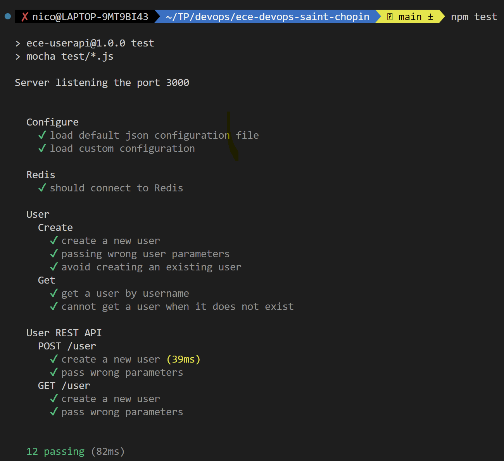

### 2. Application of CI/CD pipeline

  We chose to apply the CI/CD pipeline using Azure. The configuration file for this is [main.yml](/.github/workflows/main_project-devops-saint-chopin.yml)

- Azure pipeline

    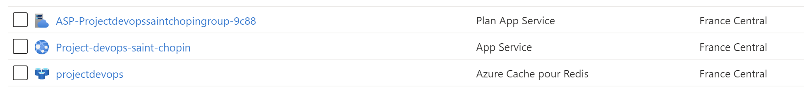

    The azure pipeline is our alternative to heroku
    It is well deployed with conclusive tests too as you can see on these pictures, in our commits, or with the link of the deployed application on our repo page.

    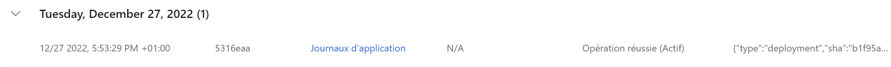

    We were able to create a redis cache DB on Azure but due to lack of time
    we have not yet been able to link it to our application to make our API work properly with this
    to make our API work properly with this cache.

  As you can see, the web application is deployed on **Azure** and visible at <https://project-devops-saint-chopin.azurewebsites.net/>.

- Heroku pipeline

    The configuration file for Heroku is [main.yml](/Project/learn-github-actions.yml)

    Having started our project a long time ago, we first deployed our deployed our application with a CI/CD pipeline using heroku.
    You can see from the images above and in our previous commits that the application was well deployed and tested successfully.

    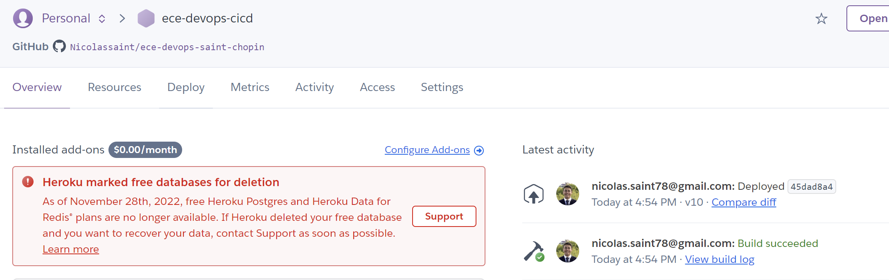

    Since heroku has become a paid service we had to find another solution with azure

### 3. Configure and provision a virtual environment and run your application using the IaC approach

- Vagrant
  In order to configure a VM with Vagrant, we created a [Vagrantfile](./Vagrantfile). Th VM is running on **CentOs/7**.

  We provisioned the VM with Ansible using **Ansible** playbook inside [run.yml](.playbooks/run.yml).

  Then, we configured a role to install Redis, Node and npm inside [main.yml](.playbooks/roles/projet/install/tasks/main.yml).

  You can run `vagrant up` to bring the VM up with VirtualBox. Then, `vagrant ssh` to go inside the VM.

  `Redis` is correctly installed :

  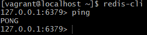

  `Node` is correctly installed :

  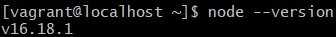

- Health checks

  For the health checks, we are in the vm. The files are copied into the opt file. This copy is used to run our application and to make the health checks. We make the command cd /opt/vagrant.

  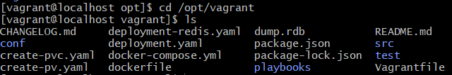

  After having installed node the npm command should be known however it does not work. So we have to install it by hand with `sudo yum install npm nodejs`.

  Then we can launch our application by doing npm install and npm run.
  However when we use npm install an error occurs. We aren't able to launch the code and especially to make the health checks with the routes created speciphysically for them.

### 4. Build Docker image of your application

- Dockerhub

    After creating our dockerfile and dockerignore,we build the docker image we push our docker image on our dockerhub with login.
    We use this command : `docker build -t devopsproject .` and `docker push nicolassaint/project-image:latest`

    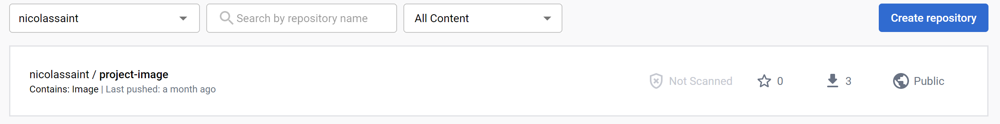

    This image will be very useful in particular for our docker-compose if we don't want to use our project our project locally, which is done for us and especially for our kubernetes part where we will usethe image of our project to get our client.

### 5. Make container orchestration using Docker Compose

- Docker Compose
    For this step, we created a [docker-compose.yml](/docker-compose.yml) containing Redis and the web application at the root of the project and ran it with `docker-compose up`. This allowed us to run the project with this container.

    
    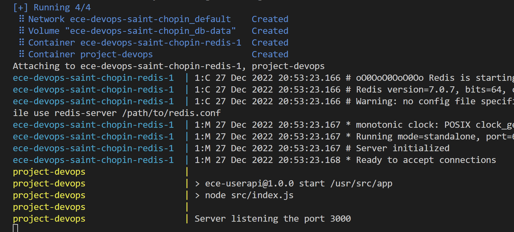

    We check that the application runs on port 3000 of our localhost <https://localhost:3000/>.

    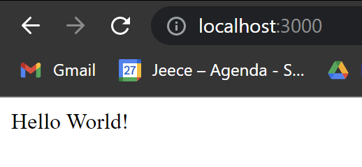

    Then we test with postman the API.

    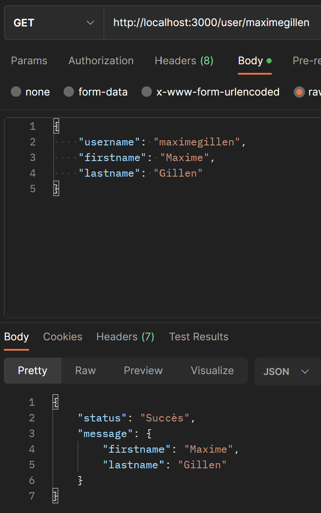
    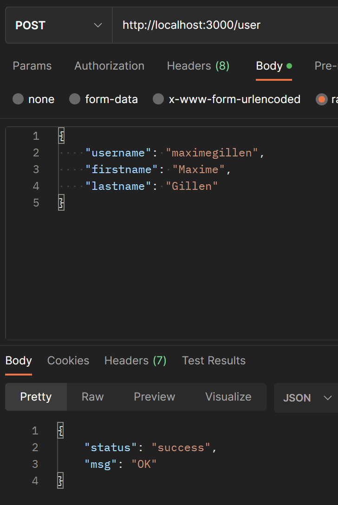

### 6. Make docker orchestration using Kubernetes

- Deployment

    First of all,we launch docker,kubernetes and minikude with `minikube start` to install a Kubernetes cluster using **Minikube**.
    Then we applay all our files to the cluster with :
  - `kubectl apply -f deployment.yaml`
  - `kubectl apply -f service.yaml`
  - `kubectl apply -f pv-volume.yaml`
  - `kubectl apply -f pv-claim.yaml`
  - `kubectl apply -f storage-class.yaml`

    We check that everything is going well.
  - `kubectl get deployments`
  - `kubectl get services`

    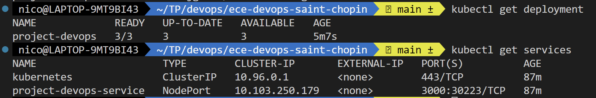

  - `kubectl get pods`

    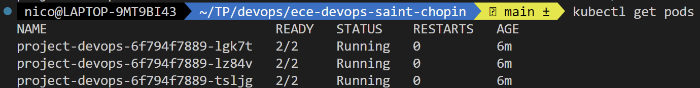

    If everything is ok we use minikube for the deployment.

    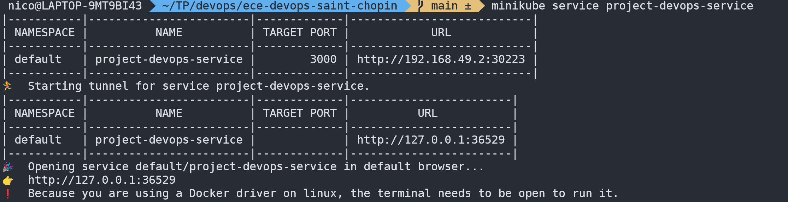

    Then we test with postman the API.

    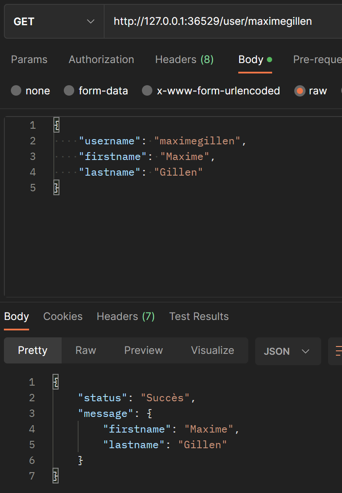
    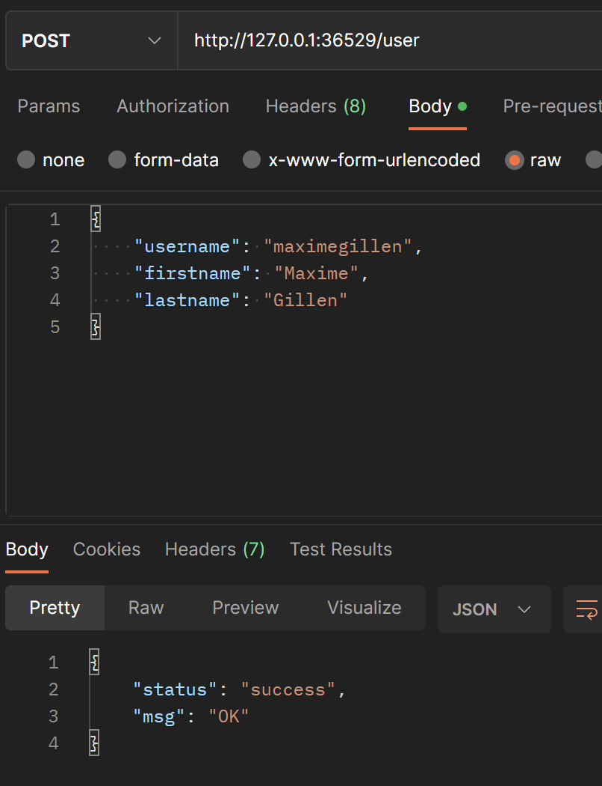

    Thanks to the PV and PVC, if we stop the pods and start them up again the DB will allow us to have our users created with the API still stored.
    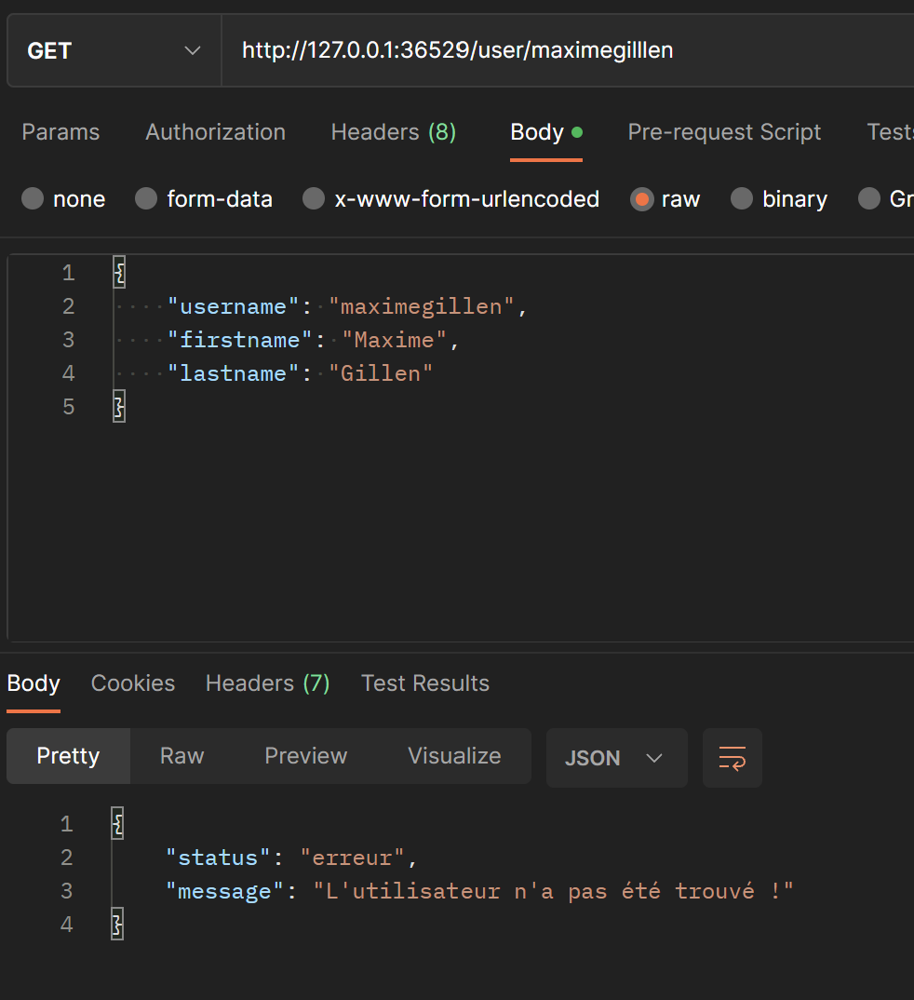

### 7. Make a service mesh using Istio

- Istio

    Before deploying our pods with istio we can see that 2/2 are ready.

    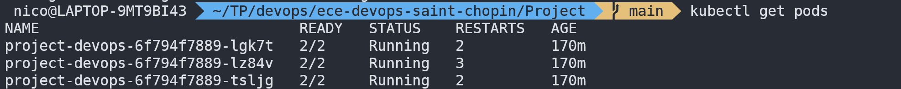

    Then, after installing istio we configure it in our cluster to deploy our app with istio by injecting istio in our pods. We have to re apply our pods.

    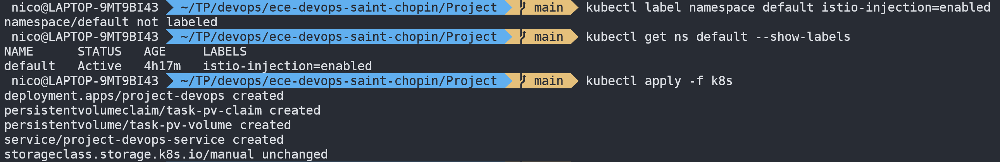

    We now see that we have 3/3 running, one was added by istio.

    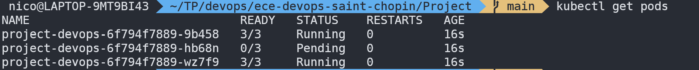

    You can see here that when we desribe our pod, istio is well injected.

    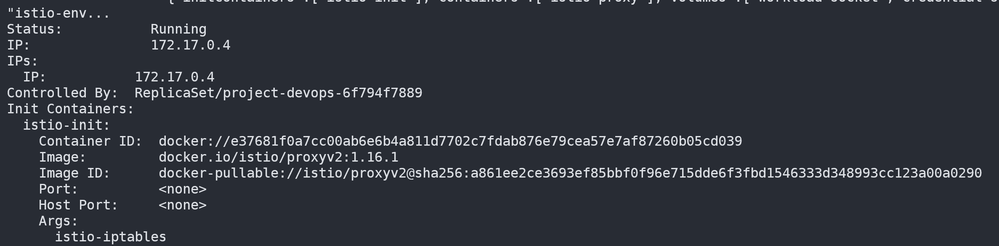
    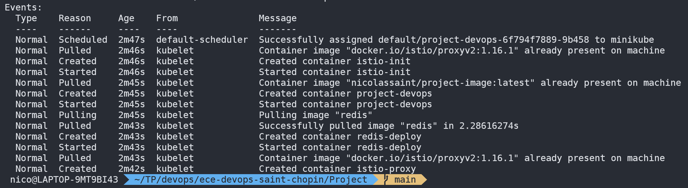

    For route requests & traffic shifting between 2 different versions of our app we have written following yaml config files

  - [virtualservice.yaml](/istio/virtualservice.yaml)
  - [gateway.yaml](/istio/gateway.yaml)
  - [destinationrule.yaml](/istio/destinationrule.yaml)

    Here, we have to use the route key in the spec field of our YAML file.

    In this example, the virtualService resource routes incoming requests to the project-devops-service, with a weight of 50% for the v1 subset and a weight of 50% for the v2 subset. This will distribute incoming requests evenly between the two versions of the app.

### 8. Implement Monitoring to your containerized application

- Installation

    First, we use the services and deployments of our monitoring tools from the istio installation folder

    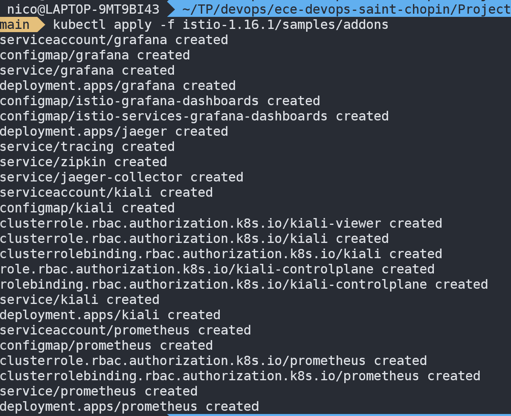

    We can see that the pods are running well

    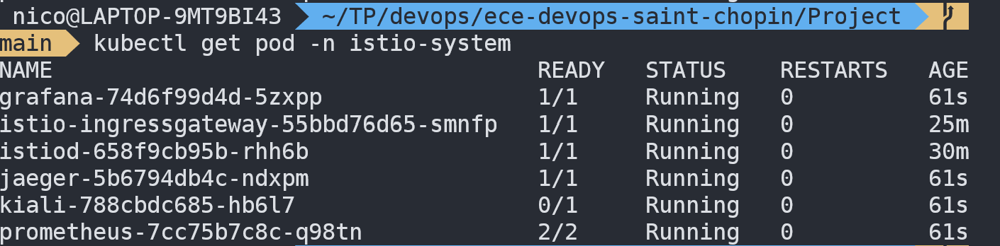

- Grafana

    We then have to deploy our pod to our localhost on the right port, here's the grafana deployment command

    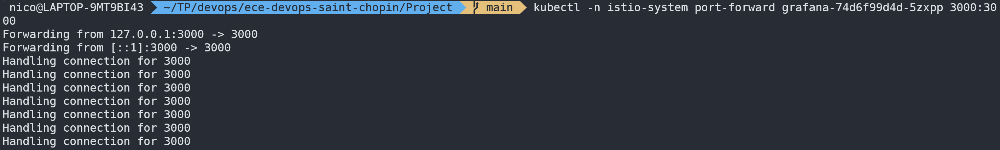

    We are then on grafana. Unfortunatly, we didnt't have time to create alerts and trigger them by shutting down our applications.

    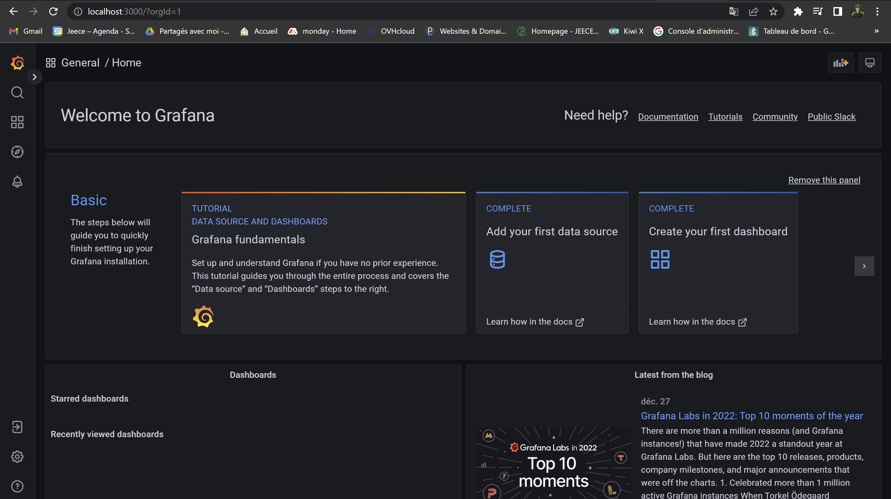

- Prometheus

    For Prometheus, we use the same process

    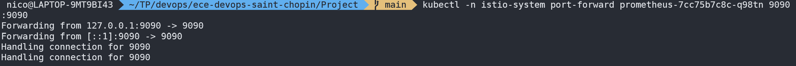

    We can now see that we're on prometheus UI

    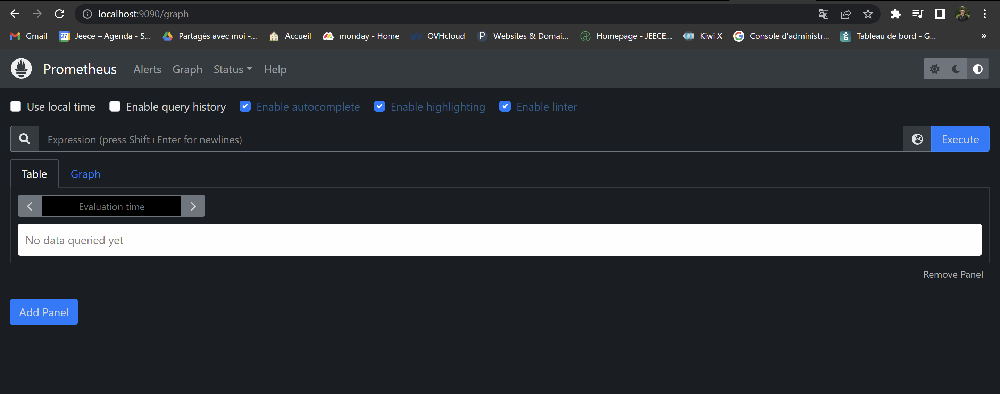

    We can then check the status or our app tha is good

    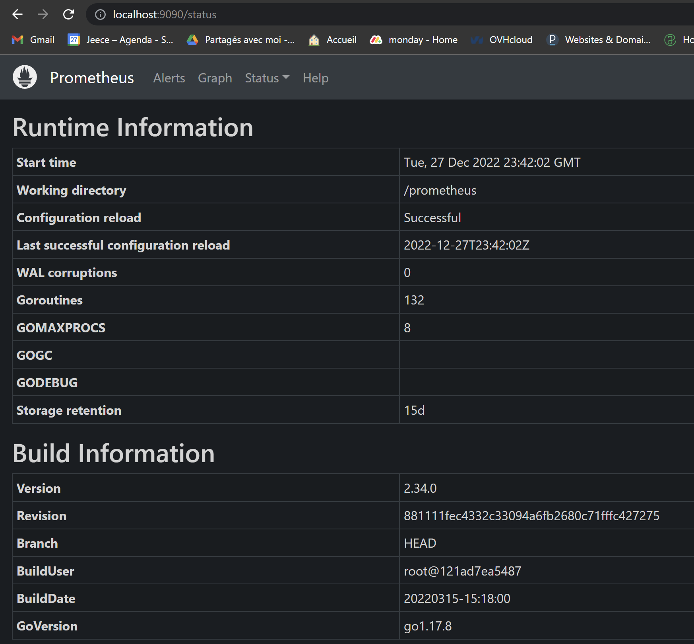
